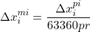

# A First Look at Sports Analytics for the Sport of Roundnet

By: Austin Ulfers

Created: March 31st, 2020

## Abstract

This paper acts as a proof of concept to track a roundnet ball within a video and recreate its path in real time. The procedures and methods implemented here are best implemented when the camera is directly above the net (i.e. a drone) and moves as little as possible. Future iterations of this project will adapt to wider scenarios however, at the moment, elementary information like ball hits/ball location/ball velocity within the game of roundnet act as a proving ground for later developments.

## Outline

This document will follow one video as we progress through the methodology. Illustrations and captures of the process will be outline along the way. Later in this document, I will cover the limitations as well as the recommendations for future implementations of similar methods.

## Introduction

As stated above, we are going to follow one video through this process of this entire paper. See the following figure for the video that will be referenced. For the duration of this project, this video will be referred to as _spike_1.mp4_

The portion of the video that will be used is as follows.

>0:02-0:11

[](https://youtu.be/UXPjH3uk0Bs?t=2)

The main reason why this project interested me so much was because of the nature of the roundnet scene. Although the game of roundnet was invented in the late 1980s by Jeff Knurek, the Spikeball company has allowed it to grow in immense popularity within the past several decades. Articles in ESPN have shed light on just how popular the sport has become. With over 4 million players world wide, there is no doubt that roundnet is here to stay.

One key element that many professional sports have is that they have a lot of game statistics. Since roundnet is pretty new to this scene of professional sports, it makes sense why they have yet to implement anything of this sort. However, after my mind got to thinking, I started brainstorming ways that I could utilize my data science skills and start tracking some of these sports metrics.

I knew tracking metrics like speed of a serve and hit count in a match were things that were easily attainable so I thought I would set out with those in mind. Below, I will demonstrate how I have implemented various machine learning techniques to attain these goals.

## Methodology

I knew I wanted Python to be the basis of this research. Although R could arguably be used here, I was personally more familiar with Python and it's packages at the start so that's that we'll use.

Here are a list of other python packages that were utilized for this research:

* **Jupyter Notebooks**, for the ability of saving data from the scripts in memory.
* **Pandas**, for data manipulation and storage.
* **Numpy**, for math features and more data manipulation.
* **PIL**, for interacting with images.
* **imutils**, for array to image transformations.
* **cv2**, a strong library for image manipulation.
* **matplotlib**, for static visualizations.
* **plotly**, for visualizations with animations.

### 1. Splicing the Video

Since we are working with a video for this project, the important first step is to split it into frames so that we are working with a 2D array of pixel values rather than 3D. For the sake of making this easier to comprehend, I will use the below frame of the video as reference for part of this methodology. It occurs around 0:02 into the video or the 72nd frame if you spliced the video exactly as I did.This figure was chosen because it has a good representation of the ball and there is a clear view of the net.

It is also important to note that while these diagram only pertains to one image, by reading through a video, frame by frame, we are able to perform this exact same analysis repititavely.


It is important to not make this image greyscale on import. Since most of our tracking is based off the color of the ball, we need the values associated with each pixel.

### 2. Thresholding

After we have loaded the currently frame, our next task is to establish a threshold within the image. While this can be performed in many different ways, resources online encouraged shifting the color format to *HSV* instead of the imported version of *BGR*. This allows for an easier range of values to be established in comparison to BGR. This was done using OpenCV's `cv2.cvtColor(img, cv2.COLOR_BGR2HSV)` command. This converted the colorscape of the image to be better processed in the next part of thresholding. Below is the image representation of the HSV landscaped version of the above image.


Now that the image is converted to HSV format, now we just need to threshold. This would be performed using OpenCV's `cv2.inRange()` function. Using this function you are able to pass in a range of HSV values in order to threshold the image based off that range of colors. Although the specific colors within videos and images can range camera and lighting scenario, for the above photo, I found that the following ranges worked best for isolating the ball and net from the rest of the noise within the image. I would anticipate that slight adjustments to the lower and upper bounds would be encouraged/nesessary in order to improve performace and accuracy on later videos.

```python
# Define range of color in HSV
lower = np.array([20, 105, 105])
upper = np.array([35, 255, 255])
```

Now that the upper and lower color bounds have been specified, it is now time to perform the threshold using the command `cv2.inRange(hsv, lower, upper)`. Altough perhaps a bit on the cautious side, I like to utilize OpenCV's `cs2.dialte()` and `cv2.erode()` functions in order to remove some potential noise from the thresholded image. Once this is all done, we should get a masked image like this.


### 3. Locating the Contours

Within this image, we can see 2 things. First we can see the ball that appears in the position that we would expect. We are also able to see where the net is based off the remaining 5 white marks within the image. From this masked image, we are now able to perform a contour analysis in order to get the location data for each of these marks.

To do this we will perform a standard procedure for getting the countours from a masked image.

```python
cnts = cv2.findContours(edged.copy(), cv2.RETR_EXTERNAL, cv2.CHAIN_APPROX_SIMPLE)
cnts = imutils.grab_contours(cnts)
```

For each contour we are now able to get metrics like the center coordinates of each contour. Now that we can track each contour, we are now able to do some filtering to remove noise and perform some math to determine which contour is the ball and which other contours are the net. One easy way that I have found to reduce small noise that may occur is just setting the minimum contour size. Although this will change based on how far away the camera is from the net, I took the mean of the net contours and subtract an arbitrary 25% so that we could only see consistently sized net contours.


Once we have removed the noise, our next task is to figure out which contour is the ball and which are the net. The easiest way that I found based off the images that I had was to just utilize the contour that has the largest area amonst the various contours. Finding the area from a conour is just calling the function `cv2.contourArea(c)`.

Now that we have established which contours are the ball, which are the net, and where they all are, we are now ready to move on. However, one last metric that we need to calculate is the center of the net based off the net contours. This can be done several different ways depending on how you structure your contours. Mathmatically speaking, the center of five net contour points is just going to be the mean of every $X$ and $Y$ value.


However, I stored my data in a table so that each contour had it's *area, cX, cY, is_ball* values are stored within a dataframe. An example one for would have the following structure. It is important to remember that within `(0,0)` is the top left of the screen.

| df | area | cX | cY | is_ball |
|---|------|----|----|---------|
| **1** | 28  | 659 | 401 | True    |
| **2** | 31  | 609 | 327 | False   |
| **3** | 30  | 606 | 328 | False   |
| **4** | 28  | 663 | 314 | False   |
| **5** | 29  | 695 | 358 | False   |
| **6** | 173  | 735 | 150 | True    |

Setting up the objects in the way allows us to groupby the result set through the `is_ball` column. Using a function similar to the following, we are able to find the center of the net and prepare our data for export in one easy go.

```python
df.groupby('is_ball').mean()
```

This partnered with a couple more lines of code in order to flatten out the result gives us the following table. This section is now complete for this frame. We can now append this data to a larger dataframe and move onto the next frame.

| df2 | mean_net_area | net_x | net_y | ball_area | ball_x | ball_y |
|-----|---------------|-------|-------|-----------|--------|--------|
| **1**  | 29.1          | 646.4 | 355.6 | 173       | 735    | 150    |

### 4. Comparing Frames

Once we have viewed all the frames and saved the data, we are now able to do some data analysis on the results that we've found. For this project, I chose to export all the data to a csv but this could all be easily added to a database instead if that where a part of the project requirements. I plan on incorporating exactly this in future iterations of this project.

Since the main topic for this research was tracking the ball, lets start with that. Since we already have the $x$ and $y$ values for the ball during each frame during the video, this will be easy enough to plot on a graph. Using a scatter plot we can plot these frames on a single graph that can represent the entire video. It is important to remember here that the y-axis starts at the top left for the frames instead of the bottom left, which is a common conception for most python library graphing packages.

The `invert_yaxis()` function worked for me to do just this.


The other metric that I focused on for this research was the ball's velocity. I thought it could be an interesting metric to track as most sports have the speed of the ball as something that is relevant. Since we have the pixel position of both the center of the ball as well as the net, we can use the roundnet net as a refernce how how far the ball is traveling.

Before we move forward this this step, it is crucial to understand some information about the video. Here are some important constants to understand:

1. The diameter of the roundnet net is 23 inches
2. The pixel length diamter of the roundnet net on each frame is rougly 90
3. The video frame rate is 30 frames per second.

With these constants in mind, we can now start to do some computations on the metrics we have to determine the velocity of the ball. Below, you can find the mathmatical equations as well as the python code that can be implemented for any one row of the data/any one frame.

 = diamter of the net in pixels  
 = frame rate of the video  

 





Here is the graph when we plot this velocity by frame of the video.


From this graph we are able to learn a little bit about what's going on. However, before we can get there, we can see some issues within the graph. The main issue is that for some frames we have a velocity of 0. This creates a graph where we see spikes of velocity and other times no movement.

One way we are able to get past this is to average this velocity over several frames to get the speed the ball is traveling. After looking back at some of the frames within the video, it is clear that the ball doesn't change position within some of the frames. While I'm not exactly sure why this is happening, it appears to be a pretty consistent occurance which suggests to me that the original video is something like 24 or 25 frames per second and when I downloaded it, it defaulted it to 30 and filled the empty frames with duplicates from prior frames.

To solve this issue, there are two potential course of actions. We can remove the empty frames and act as if the video occured in the adjusted frame rates, or we can average the still frames from the frame before and the frame after and use that as the ball's data within that frame. While there are pros and cons to both of these techniques, it is suggested that you just redownload the video in the original frame rate and repreform the calculations.

Since I don't have the option to redownload in a different frame rate, I am going to chose the option of averaging the still frames from the one before and after. While not perfect, it does a good enough job while still retaining the true time associated to each frame of the video.

So, now that we have decided a route to go down and have adjusted our data to reflect the averaged information from the surrounding frames, it is now time to calculate the speed at each given frame. The best way to do this is to take the average of the velocity from the previous frames and call that the speed at the current frame. Now the question becomes: how many prior frames are worth averaging to get the best result. While this can be a case by case question, I chose this value to be 5 in order to minimize the overlap from the still frames. The following formula can be used to calculate any frame's speed.


With this more averaged out data, our averaged speed over time graph looks something a little like this.


## Results

By combining the two previous graphs together, we are able to see the ball being tracked over time with the speed and location of the ball.


From the velocity graph, we can now see where every hit is located. Whenever there is a local minimum, we can confidently say someone hit the ball. Based off this next figure we can see that there were indeed 7 hits within this match.


## Recommendations

Since this is mainly just a proof of concept, there are both a ton of recommendations and limitations with this pipeline that have been created this far. I will start with the improvements that will discuss the limitations following.

With some more analysis and work:

* Serving speed
* Hit speed by player
* Categorizing types of serves and their success rates against different players
* Indiviudal player stats
* Tracking players throughout the course of a match
* This process performed in real time
* All data uploaded to a database
* API creation for uploading and retrieving data

## Limitations

* The current program asssigns the ball to the contour with the maximum area. However, when the ball goes offscreen, the frame should count just as having no ball instead.
* Sometimes, the ball is smaller than the 5 net pieces that are captured so the ball jumps to an incorrect location.
* The center of the net is off if a player is covering a net contour piece.
* Program should be able to see where the location of the ball was a frame or two before in order to estimate where the ball will go next.
* Current video only shows concept on sand, no other terrain have been tested yet.
* Program will get confused if any player is wearing the same color as the roundnet ball.
* Drone will move around slightly and the current version does nothing to compensate for these small movements.
* Velocity that is derived here is only one a 2D plane, however, in reality, there is a vertical axis as well that is unaccounted for currently. More linear kinematics physics will be required here.
* No current code has been written to find the local minimums on the velocity over time graph.
* Lower and upper colors bounds will shift depending on the lighting condition within the scene.

## Conclusion

Although the list of limitations may seem daunting, this paper has been able to shed some light on the future capabilites of this current work. As evident from the popularity of roundnet in recent years along with the desire for the sport to continue to grow. Match and player analytics are an important next step that is required to elevate the sport to the next level. Implementing this procedure into a broader pipeline could fulfill a lot of these desires and has the potential to expand roundnet in an area that currently remains to be discovered.

## References

1. [_"Incredible Aerial Footage of Roundnet"_](https://youtu.be/UXPjH3uk0Bs?t=2) Created 2015-08-17.
2. [_"A Spike In Interest"_](https://rcgcspring2016journalism.wordpress.com/2016/04/05/a-spike-in-interest/) Created 2016-05-16

3. [_"How Spikeball Became Mainstream"_](https://www.espn.com/espn/story/_/id/23915064/how-spikeball-became-mainstream) Created 2018-07-04

4. [_"Ball Tracking with OpenCV"_](https://www.pyimagesearch.com/2015/09/14/ball-tracking-with-opencv/) Created 2015-09-14

5. [_"Changing Colorspaces"_](https://opencv-python-tutroals.readthedocs.io/en/latest/py_tutorials/py_imgproc/py_colorspaces/py_colorspaces.html) Retrieved 2020-03-25

6. [_"OpenCV Center of Countour"_](https://www.pyimagesearch.com/2016/02/01/opencv-center-of-contour/) Created 2016-02-01

7. [_"Spikeball Set Dimensions"_](https://support.spikeball.com/article/219-what-are-the-dimensions-of-the-spikeball-set) Updated 2020-02-27
